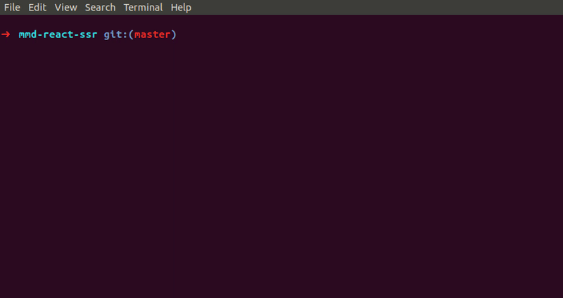

# mmd-react-ssr

A React Server Side rendered application template (isomorphic) with support fetch data like Next.js using React Router



🔥 Using React Router.

🔥 Support Hot Reloading!!!

🔥 Code splitting by [`loadable-components`](https://loadable-components.com/), recommended solution by [`React Team`](https://reactjs.org/docs/code-splitting.html#reactlazy)

🔥 Code validation with `eslint` and `airbnb`.

🔥 Code formatting with `prettier`.

🔥 Style validation and formatter with `stylelint`.

🔥 Unit testing with `jest` and `react-testing-library`.

🔥 Support `postCSS`.

🔥 Support `SASS/SCSS` by default. Import all your `SASS/SCSS` files in `styles/App.scss`.

🔥 You can extends configs and setup your needs. All webpack configs are in `webpacks` directory.

## Requirements

- `NodeJs` v10 above
- `yarn`

## How to use

1- git clone this project.

2- remove `.git` folder.

3- `yarn install` || `npm install`

4- `yarn start` || `npm run start`

now start coding !!

you can see in `http://localhost:3000`.

## Production and Deployment

1- Run `yarn build` or `npm run build`. a `build` folder will be created that ready for deployment.

2- Now serve the `build` folder with `NodeJs`.

`node build/server.js`

note: Suggest using [`pm2`](http://pm2.keymetrics.io/)

## How to fetch data ssr

All route components with a `static property` called `getInitialData` can fetch data on `server` and pass down data as props called `initialData`.
you can see examples in `screens/Projects.jsx` or `screens/About.jsx`.

#### Steps:

2- add a `static async getInitialData` to the a route component:

- after component definition:

```
Component.getInitialData = async ({ match, req, res, history, location }) {
    const api = await axios.get('https://jsonplaceholder.typicode.com/users');

    return { ...api.data };
}
```

- or during component definition:

```
const Component = () => {
  static async getInitialData({ match, req, res, history, location }) {
    const api = await axios.get('https://jsonplaceholder.typicode.com/users');

    return { ...api.data };
  }
}
```

note: we use axios because support node.js and browser.

3- now you can access your fetched data as `initialData` component props;

## getInitialData parameters:

- match (matched route, both on server and client)
- req (request object ExpressJs, only server)
- res (response object ExpressJs, only server)
- history (react router history, only client)
- location (react router location, only client)

## RouteComponents props

- `initialData`: fetched data for SSR. If you don't make SSR this component it will be `null`.
- `reFetch`: fetch again data by calling `getInitialData` if provided in component
- `isLoading`: loading when getting data with `getInitialData`.
- `RouteComponentProps` provided by `react-router`. You can see them here [withRouter](https://reacttraining.com/react-router/core/api/withRouter)

## How to manage `head`

you can use `react-helmet` like before in your components.

## Code splitting

Code splitting in this project implemented by [`loadable-components`](https://loadable-components.com/).

For routes component you should use our `asyncComponent` in `routes.js` file. the `asyncComponent` will take care of code splitting and `getInitialData` if provided on component. see usage in `routes.js`.

example:

`asyncComponent(()=> import("./screens/Projects.jsx"))`

for other components you could see [`loadable-components`](https://loadable-components.com/) documents. but as a short example:

```
import loadable from '@loadable/component'
const OtherComponent = loadable(() => import('./OtherComponent'))
function MyComponent() {
  return (
    <div>
      <OtherComponent />
    </div>
  )
}
```

Please visit `loadable-components`](https://loadable-components.com/) documents for advanced usages and configuration.

Inside `asyncComponent` we use a simple `loading ...` message until component loaded completely. If you want you can customize it.

## How to test

1- create folder `__tests__` under your component directory.

2- create file with `filename.test.js` or `filename.spec.js`. for example `Projects.spec.js`.

3- write tests.

4- enter `yarn test` || `npm run test` for run tests, or `yarn test:watch` || `npm run test:watch` to run in watch mode.

note: you can create test file without `__tests__` folder but for better file structure keep it in `__tests__`.

---

# Inspiration

- [razzle](https://github.com/jaredpalmer/razzle)
- [facebookincubator/create-react-app](https://github.com/facebookincubator/create-react-app)
- [zeit/next.js](https://github.com/zeit/next.js)
- [after.js](https://github.com/jaredpalmer/after.js)
- [jaredpalmer/react-router-nextjs-like-data-fetching](https://github.com/jaredpalmer/react-router-nextjs-like-data-fetching)
- [vue-cli](https://cli.vuejs.org/)
